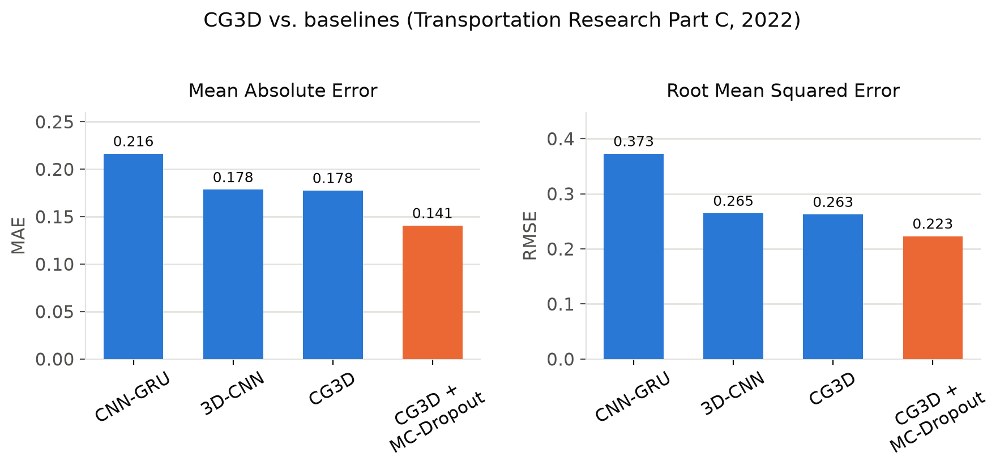

# CG3D — 4D Flight Trajectory Prediction (Transportation Research Part C)

Code for:

> H. Shafienya and A. C. Regan, **"4D flight trajectory prediction using a hybrid
> Deep Learning prediction method based on ADS-B technology: A case study of
> Hartsfield–Jackson Atlanta International Airport (ATL),"**
> *Transportation Research Part C: Emerging Technologies*, vol. 144, 2022, 103878.
> [doi.org/10.1016/j.trc.2022.103878](https://doi.org/10.1016/j.trc.2022.103878)

## What this is

4D trajectory prediction (latitude, longitude, altitude/heading, and time)
for aircraft approaching ATL, built from historical ADS-B data. The paper
proposes **CG3D**: a fusion of a hybrid CNN-GRU (spatial features through a
1D-CNN, temporal features through a GRU) with a 3D-CNN (C3D) branch, plus a
Monte-Carlo-Dropout variant for uncertainty estimation. CG3D is compared
against six baselines: CNN, GRU, LSTM, MLP, C3D alone, and CNN-GRU alone.

| Model | Reported MAE | Reported RMSE |
|---|---|---|
| CNN-GRU | 0.2164 | 0.3728 |
| 3D-CNN | 0.1785 | 0.2646 |
| **CG3D** | **0.1776** | **0.2626** |
| CG3D + MC-Dropout | **0.1406** | **0.2231** |

(From Tables 3–4 of the paper; errors are on PCA-reduced, standardized
targets — see "Notes on faithfulness" below.)



## Repo structure

```
paper1_cg3d_atl/
├── data/                  # sample_flight_data.csv is synthetic (see below)
└── src/
    ├── make_sample_data.py  # generates a demo trajectory
    ├── preprocessing.py      # interpolation, sliding window, scaling, PCA
    ├── models.py              # all 8 model builders (CNN, GRU, LSTM, MLP,
    │                          # C3D, CNN-GRU, CRC3D/CG3D, CG3D+MCDropout)
    ├── train.py               # CLI: build, fit, evaluate, save
    └── evaluate.py            # MAE/RMSE + history/metric logging
```

## Setup

```bash
python3 -m venv .venv && source .venv/bin/activate
pip install -r ../requirements.txt
```

## Quickstart (synthetic demo data)

The real experiments use OpenSky Network ADS-B history for ATL
(Feb 28 2020 – Mar 30 2020 / Mar 30 2016 – Mar 30 2020 depending on the
draft), which is too large and not ours to redistribute. `make_sample_data.py`
fabricates a short, physically plausible single-flight trajectory with the
same columns so you can run the full pipeline immediately:

```bash
python src/make_sample_data.py --rows 5000 --out data/sample_flight_data.csv

# Any single model:
python src/train.py --data data/sample_flight_data.csv --model crc3d_mc \
    --epochs 20 --batch-size 512

# The full comparison, like Table 3/4 in the paper:
python src/train.py --data data/sample_flight_data.csv --model all \
    --epochs 500 --batch-size 512
```

`--model` accepts `cnn`, `gru`, `lstm`, `mlp`, `c3d`, `cnn_gru`, `crc3d`
(= CG3D), `crc3d_mc` (= CG3D + MC-Dropout), or `all`. Results (trained model,
per-epoch history, and MAE/RMSE in both PCA space and inverse-transformed
physical units) are written to `--output-dir` (default `results/`).

## To reproduce the paper's results

Point `--data` at your own ADS-B extract with columns
`time, lat, lon, heading, velocity, vertrate, hour` (see
[OpenSky Network](https://opensky-network.org/) for historical data access),
and use `--window-size 100` (the paper's sliding-window length) with
`--epochs 500 --batch-size 512`, matching the paper's training setup.

## Notes on faithfulness to the original code

This is a cleaned-up, modernized (TensorFlow 2 / `tf.keras`) rewrite of the
original research script, restructured into reusable modules. The model
architectures, layer sizes, dropout rates, and training hyperparameters are
unchanged. A few genuine bugs in the original script were fixed along the way:

- `CuDNNGRU`/`CuDNNLSTM` (removed in TF2) replaced with `GRU`/`LSTM`, which
  use the cuDNN kernel automatically under the same conditions.
- Two spots called `BatchNormalization(x)` instead of `BatchNormalization()(x)`
  (constructing the layer with `x` as an argument rather than calling it on
  `x`) — fixed.
- Output layer sizes were hard-coded (e.g. `Dense(6)`) assuming a specific
  PCA-reduced dimensionality; they're now inferred from the data.
- A no-op data-chunking loop that reread the whole CSV without changing
  behavior was removed.
- ~900 lines of copy-pasted "dump this metric to .txt then re-read it into a
  .csv" boilerplate were replaced with one `evaluate.save_history()` call.
