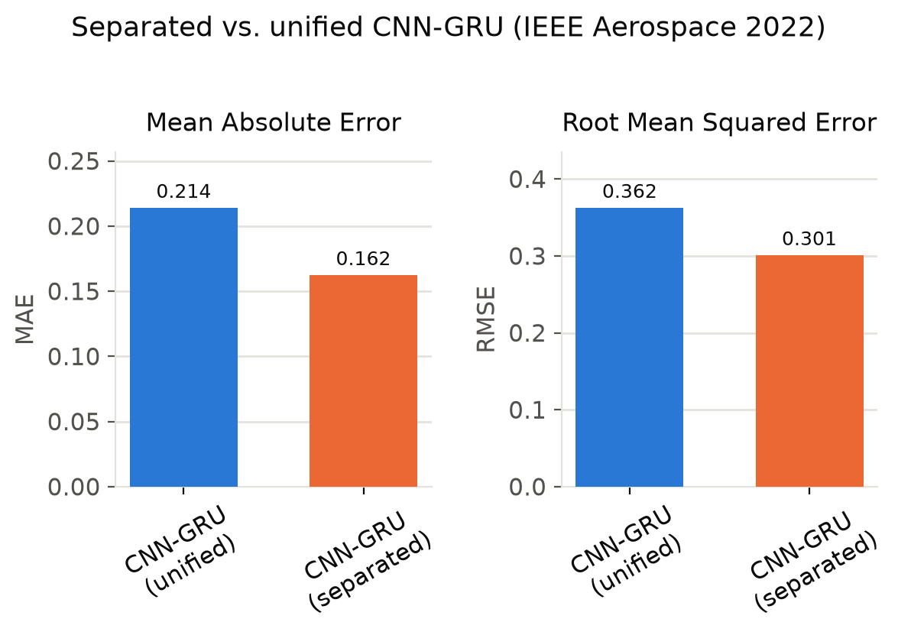

# CNN-GRU Separated vs. Unified — 4D Flight Trajectory Prediction (IEEE Aerospace 2022)

Code for:

> H. Shafienya and A. C. Regan, **"4D Flight Trajectory Prediction based on
> ADS-B data: A comparison of CNN-GRU models,"**
> *2022 IEEE Aerospace Conference*, Big Sky, MT, 2022.
> [doi.org/10.1109/AERO53065.2022.9843822](https://doi.org/10.1109/AERO53065.2022.9843822)

## What this is

A hybrid CNN-GRU model for long-term (strategic) 4D trajectory prediction,
comparing two ways of feeding it spatio-temporal ADS-B features:

- **Separated**: spatial features (lat, lon, heading) go through a 1D-CNN,
  temporal features (time, velocity, vertical rate, hour) go through a GRU,
  and the two branches are concatenated before the output head — the
  paper's proposed architecture.
- **Unified**: all features are concatenated up front and passed through a
  single CNN followed by a GRU — the common/baseline approach.

| Architecture | Reported MAE | Reported RMSE |
|---|---|---|
| **CNN-GRU, separated (proposed)** | **0.16223** | **0.30077** |
| CNN-GRU, unified | 0.21389 | 0.36237 |

The separated architecture reduces MAE by 35.85% and RMSE by 20.48% over the
unified one (Table 2 of the paper).



## Repo structure

```
paper2_cnn_gru_comparison/
├── data/                  # sample_flight_data.csv is synthetic (see below)
└── src/
    ├── make_sample_data.py
    ├── preprocessing.py    # interpolation, sliding window, scaling, PCA
    ├── models.py             # build_cnn_gru_separated / build_cnn_gru_unified
    ├── train.py              # CLI: build, fit, evaluate, save
    └── evaluate.py
```

## Setup

```bash
python3 -m venv .venv && source .venv/bin/activate
pip install -r ../requirements.txt
```

## Quickstart (synthetic demo data)

The paper trains on one month of OpenSky Network ADS-B history for ATL,
which isn't included here (too large, not ours to redistribute).
`make_sample_data.py` fabricates a short, plausible flight trajectory with
matching columns so the pipeline runs end-to-end immediately:

```bash
python src/make_sample_data.py --rows 5000 --out data/sample_flight_data.csv

python src/train.py --data data/sample_flight_data.csv --model both \
    --epochs 20 --batch-size 512
```

`--model` accepts `separated`, `unified`, or `both`. Results (trained model,
per-epoch history, MAE/RMSE in both PCA space and inverse-transformed
physical units) are written to `--output-dir` (default `results/`).

## To reproduce the paper's results

Point `--data` at your own ADS-B extract with columns
`time, lat, lon, heading, velocity, vertrate, hour`, and use
`--window-size 50` (the paper's sliding-window length) with
`--epochs 500 --batch-size 512`.

## Notes on faithfulness to the original code

Cleaned up and modernized (TensorFlow 2 / `tf.keras`) from the original
research script; architecture, layer sizes, and hyperparameters are
unchanged. Fixes made along the way:

- `CuDNNGRU` (removed in TF2) replaced with `GRU`, which uses the cuDNN
  kernel automatically.
- Output layer sizes were hard-coded assuming a specific PCA-reduced
  dimensionality; they're now inferred from the data.
- In the unified model, the original script computed a `Dropout(0.35)` layer
  after the GRU but then fed the *pre-dropout* tensor into the final `Dense`
  layer — the dropout was silently a no-op. This version wires it correctly.
- Two auxiliary `Dense` output heads inside the CNN and GRU branches were
  built but never trained against a target (dead code left over from an
  earlier experiment) — removed; only the final fused output is trained.
